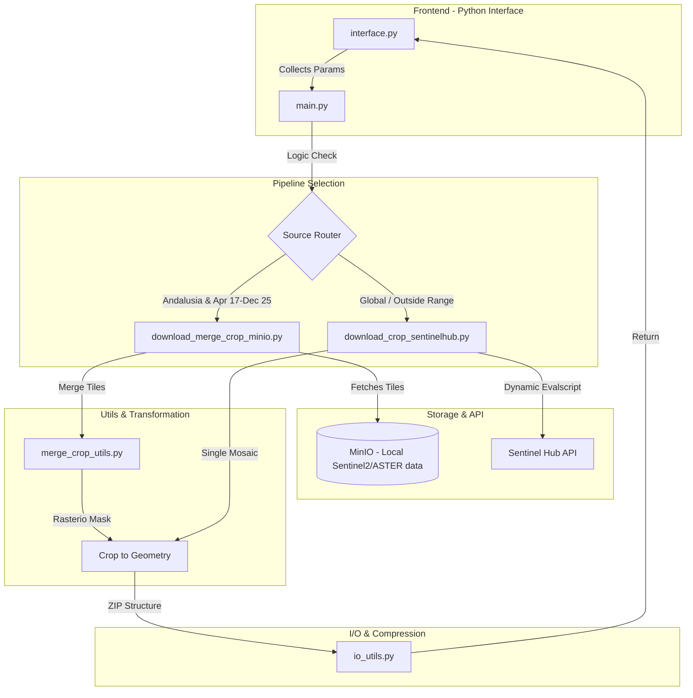

# Project Architecture

## Overview

This project provides a **robust geospatial ETL pipeline for satellite imagery**, designed to support agricultural and environmental monitoring. **It orchestrates data retrieval from two distinct sources:** a high-performance **propietary MinIO instance** (containing historical data for Andalusia) and the **Sentinel Hub API** (for global on-the-fly requests). The system intelligently routes requests based on spatial and temporal constraints, ensuring users receive precisely cropped, multi-band spectral or topographic data in a standardized structure.

## Components Diagram (Orchestration Pattern)

### Frontend
The user interface is built using **Gradio**, prioritizing a rapid, data-centric workflow for geospatial analysts:

- **Input Interface (*interface.py*)**: A centralized dashboard that leverages Gradio components to collect user parameters, including temporal ranges, product selections (indices/bands), and geometry inputs.
- **Geometry Acquisition:** Supports a three-pillar approach for spatial definitions: uploading local GeoJSON files, performing Cadastral Reference queries via `sigpac-tools`, or direct drawing on interactive Folium maps.
- **Result Visualization:** Once the pipeline completes, the frontend  provides direct download links for the generated `.zip` packages and the validated geometry file.

### Backend (Logic Services)
The backend is organized into **specialized utility modules and orchestration pipelines** to handle high-volume raster data:

- **Pipeline Orchestrators:**
  - **MinIO Pipeline:** Optimized for local Andalusia data; manages the retrieval and merging of pre-existing Sentinel-2 and ASTER tiles from object storage.
  - **Sentinel Hub Pipeline:** A dynamic bridge that generates Evalscripts on-the-fly to perform remote pixel-level math for global requests.
- **Geospatial Utils (*geospatial_utils.py & merge_crop_utils.py*):** The engine of the application. It handles the critical task of aligning diverse coordinate reference systems (CRS) and executing the final rasterio mask operations.
- **Data Consistency:** Uses `SQLModel` for authentication logic and MinIO Client to interface with structural databases and object storage. `Structlog` provides detailed, machine-readable telemetry for every step of the ETL process.

## Technologies

### Frontend & Interface
- **Gradio:** Core framework for building the rapid web interface and handling file deployments.
- **Folium:** Integrated for interactive map rendering and spatial data visualization.

### Geospatial Logic & Processing
- **Rasterio:** Primary engine for raster I/O, tile merging, and spatial masking.
- **Sentinel Hub SDK:** Facilitates the OGC-compliant interface for on-the-fly satellite data composition.
- **GeoPandas & Shapely:** Used for geometry validation, CRS reprojecting, and handling vector data.
- **`sigpac-tools`**: Specialized propietary package for querying Spanish cadastral geometries and SIGPAC data.

### Infrastructure & Operations
- **MinIO:** High-performance object storage for the local Andalusia S2/ASTER archive.
- **`SQLModel`:** An ORM for interacting with the application's authentication databases.
- **`Structlog`:** Advanced logging library for tracing complex pipeline execution and error handling.
- **`Bcrypt`:** Implemented for securing sensitive access credentials and user data.

## Design Choices

### Automated Pipeline Orchestration
The app removes the burden of source selection from the user. By analyzing the input constraints (Date + Lat/Long) in `get_product_for_parcel.py`, the system ensures the most cost-effective and fastest data source is utilized without manual intervention.

### Standardized Output Structure
To support downstream Data Science workflows, all outputs are forced into a rigid, predictable ZIP structure:
```
[Product_Key]/[Year]/[Month]/[Filename].tif.
```
This includes the serialization of the request's geometry as a GeoJSON, allowing users to verify the exact spatial context of their data. A README file is also provided to better understand the output data.

### User Data Isolation
Results data are stored using a system that prevents overwriting from other concurrent users on the app:
- User name is used to generate the root directory for that specific user's results.
- A randonly generated job directory directory name is then used for every run of the main logic.
While deployed, the app pings a funtion regularly (default is 30 min) and checks what results have been stored for a long time (defaults is 2 hours). When detected it deletes the job directory and its contents automatically, preventing old results from cluterring disk space.

### Numerical Stability (Evalscripts)
For Sentinel Hub requests, the architecture injects "Stability Guards" into the JavaScript Evalscripts. This ensures that spectral indices involving division (like NDVI) do not return Infinity or NaN values, which would otherwise "corrupt" the resulting GeoTIFF files for standard GIS software.
