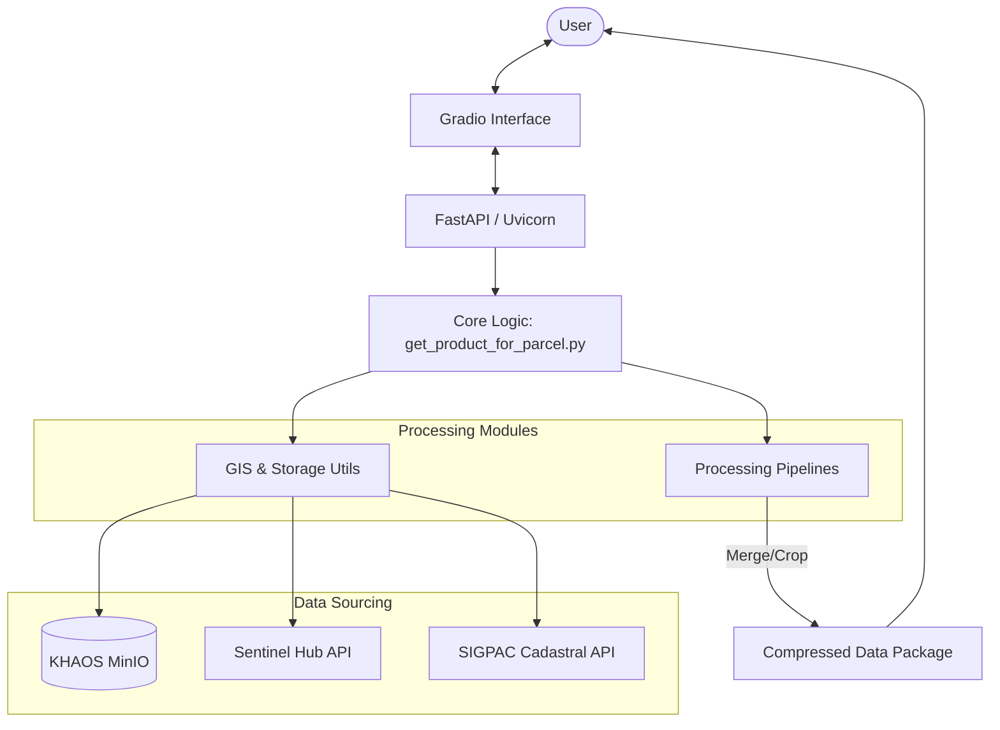

# Software Architecture

This document provides a detailed overview of the system architecture for the Satellite Crop & Merge Data Space service.

## Architectural Overview
The service is designed as a modular application that bridges user requests for satellite data with multiple data providers (Local MinIO and Sentinel Hub). It follows a layered approach:
1. **Presentation Layer**: Built with Gradio for an interactive web interface.
2. **Application Layer**: Managed by FastAPI to handle requests and routing.
3. **Domain/Service Layer**: Core logic for satellite product retrieval, geometric cropping, and data merging.
4. **Data Access Layer**: Integration with external APIs (Sentinel Hub) and object storage (MinIO).

## Architecture Diagram

## Component Breakdown

### 1. Presentation Layer (`interface.py`)
- Responsible for rendering the UI components.
- Handles user inputs: GeoJSON uploads, SIGPAC references, and Map interactions.
- Communicates with the core logic to trigger data retrieval jobs.

### 2. Core Service (`get_product_for_parcel.py`)
- The central orchestrator of the application.
- Determines the data source (MinIO vs Sentinel) based on user selection and availability.
- Manages the lifecycle of a "Job": from geometry validation to final product packaging.

### 3. Processing Pipelines (`pipelines/`)
- Contains specialized logic for different types of satellite products.
- Implements merging algorithms for multi-tile satellite data.
- Handles spatial cropping based on the provided parcel geometry.

### 4. Utilities (`utils/`)
- **MinIO Wrapper**: Simplified interface for interacting with the object storage.
- **GIS Utils**: Functions for coordinate transformation, geometry validation, and raster processing (using Rasterio and Shapely).
- **Authentication**: Logic for user login and credential verification.

### 5. Schema & Configuration (`schema.py`, `config/`)
- Defines Pydantic models for request/response validation.
- Centralizes configuration management via environment variables.

## Interdependencies
- **Frontend-Backend**: The Gradio UI depends on the core service functions to process data.
- **Service-Source**: The core logic is decoupled from data sources through utility abstractions, allowing for easy addition of new providers.
- **Processing-Library**: Heavy reliance on the Python GIS ecosystem (GDAL, Rasterio, GeoPandas) for all spatial operations.
